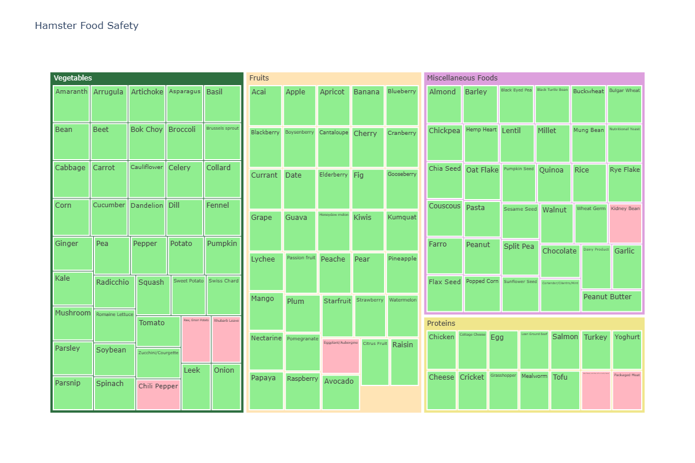

# Hamster Bites
Database of foods that hamsters can/cannot eat, including frequency and controversiality.
## Setup
pip install -r requirements.txt
## Data Structure
| Column | Type | Description |
|--------|------|-------------|
| food | string | food name (singular) |
| type | categorical | fruits, vegetables, proteins, or miscellaneous foods |
| safe | boolean | is food safe for hamsters? (true/false) |
| controversial | boolean | is this a controversial food? (T/F) |
| notes | string | specific preparation instructions |
## Data Preview
📊 **[View complete dataset](data/clean_hamster_foods.csv)** (150+ foods)

## Data Visualization

## Interactive Visualization
[🔗 View Interactive Treemap](https://htmlpreview.github.io/?https://github.com/yourusername/hamster-bites/blob/main/images/hamster_food_treemap.html)

This treemap shows:
- **Parent rectangles**: Food categories (Fruits, Vegetables, etc.)
- **Child rectangles**: Individual foods
- **Green**: Safe foods | **Pink**: Unsafe foods

### Sample Data
| food | type | safe | controversial | notes |
|------|------|------|---------------|-------|
| Apple | Fruits | true | false | prepared any way |
| Broccoli | Vegetables | true | false | prepared any way |
| Chocolate | Miscellaneous Foods | false | true | prepared any way |
| Chili Pepper | Vegetables | false | false | or any hot pepper |
| Rice | Miscellaneous Foods | true | false | cooked and dry |

*Showing 5 of 150+ foods. Click link above to view complete dataset.*
## Progress
1.scraped all food items from webpage into dataframe and saved to a csv: https://ontariohamsters.ca/education/Food-safety.html \
2.added controversial column (boolean) and got rid of controversial food type\
3.removed duplicates from dataframe\
4.removed parenthetical names and added notes section with default value 'prepare any way'\
5.got rid of dangerous food type and mapped to vegetables, fruits, proteins, and miscellaneous\
6.added more details to notes section\
7.sorted controversial foods into types\
8.removed duplicates and plural versions of foods from df\
9.converted data types of df: food (string), type (categorical), safe (boolean), controversial (boolean), notes (string)\
10.basic stats and category breakdown with count and percentages of dangerous and controversial foods calculated
11.created a tree map of food type and safety status
    **TODO: data visualization**
    -create bar charts with basic stats
    -make some aggregation/pivot tables to make charts
    -think about connecting to FDA API to find out which foods have high sugar/salt/water content as predictor of safety\

## Ideas
create a website so people can add to the database and then post on r/hamsters\
requires setting up a db though so mongodb or sql (decide)\
adding sugar/sodium info from FDA API for predictive modelling of safe/unsafe